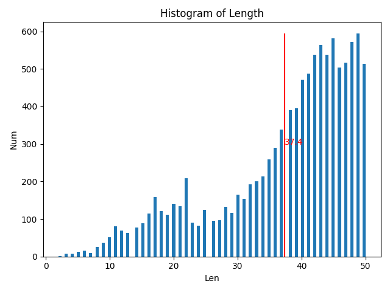

## CatNLP

👋本项目聚焦于NLP技术，包括不限于命名实体识别，实体关系抽取，文本匹配，实体链接等技术

### 索引

### 命名实体识别（NER）

#### 想法

- FLAT + 词典类别，添加词典包括词典的类别

#### 分析工具

```
python analysis.py
```

以CLUE NER训练集为例：

长度统计

    count:  10748
    mean:   37.38
    std:    10.71
    min:    2
    50%:    41
    70%:    45
    90%:    49
    max:    50

文本长度直方图



类别数目横条图


#### BiLSTM

```
python train.py --task=NER --train_config=data/config/ner/bilstm.yaml --log_config=data/config/ner/logging.yaml
```

#### BERT

```
python train.py --task=NER --train_config=data/config/ner/bert.yaml --log_config=data/config/ner/logging.yaml
```

#### ALBERT_TINY

```
python train.py --task=NER --train_config=data/config/ner/albert_tiny.yaml --log_config=data/config/ner/logging.yaml
```
